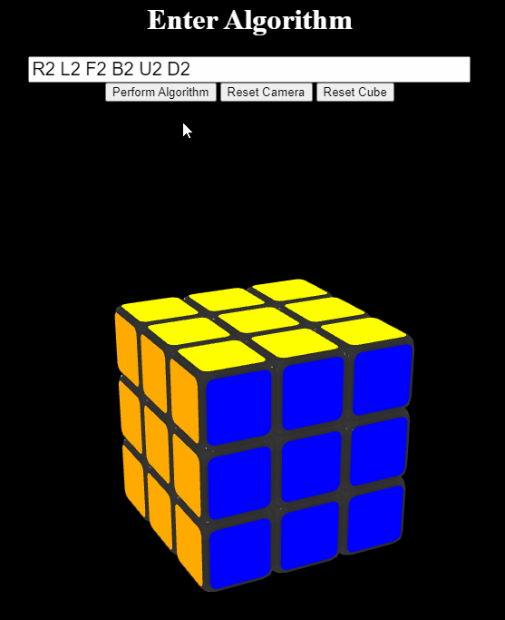

# 3D Rubik's cube with Three.js

This is the first draft of a 3D Rubik's cube rendered in the browser using Three.js.

Currently you can input an algorithm using standard Rubik's cube notation.

Click on any of the black area thats not the header with the text input to move the camera around the cube

# Getting started

If youre just looking to play with it, open the terminal and run `npm start`
then open `localhost:8000/index.html`

## To Start Developing

run `npm install`

Once evertyhings done downloading:

run `npm run build`

This will start the webpack development server and automatically bundle the javascript files as you save them.

run `npm run start`

As you make changes, you should see them at `localhost:8000/index.html`

# Notation Explanation:

Rubik's Cube notation is a string of space separated letters. Each letter corresponds to some rotation of some layer relative to the side facing you.

## Notation Letters:

R: Right Layer

L: Left Layer

U: Top Layer (U = Up)

D: Bottom Layer (D = Down)

F: Front Layer

B: Back Layer

## Notation Modifiers

Each letter can have up to one modifier as its neighbor. The modifiers are 2 or '.

if there is no modifier then you rotate the specified layer 90 degrees clockwise.

if the modifier is 2 it means you need to rotate the specific layer 180 degrees

if the modifier is ' then you rotate the specified layer 90 degrees counter clockwise

For example assume that the blue side is facing forward directly at you:

## Note for the gifs:
The actual movement is much smoother than it appears in the gif, the recording software I used rendered it a bit odd.

## R

## R'

## R2

The rest of the layers follow suit, note that a clockwise turn is the direction it would move if that layer was directly facing you.

## How to Input the algorithm

# Algorithms to try

In case youre want to see some cool patterns copy and paste these into the algorithm textbox

## Super Flip
>U R2 F B R B2 R U2 L B2 R U' D' R2 F R' L B2 U2 F2

## Checkerboard
>U2 D2 R2 L2 F2 B2

## Checkerboard in a cube
>B D F' B' D L2 U L U' B D' R B R D' R L' F U2 D

## Cube in a cube in a cube
>U' L' U' F' R2 B' R F U B2 U B' L U' F U R F'